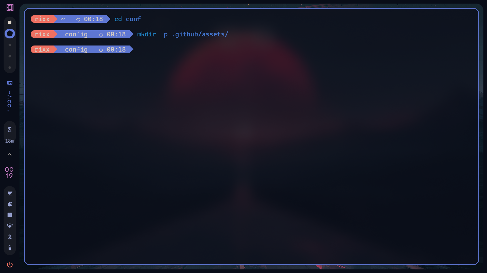
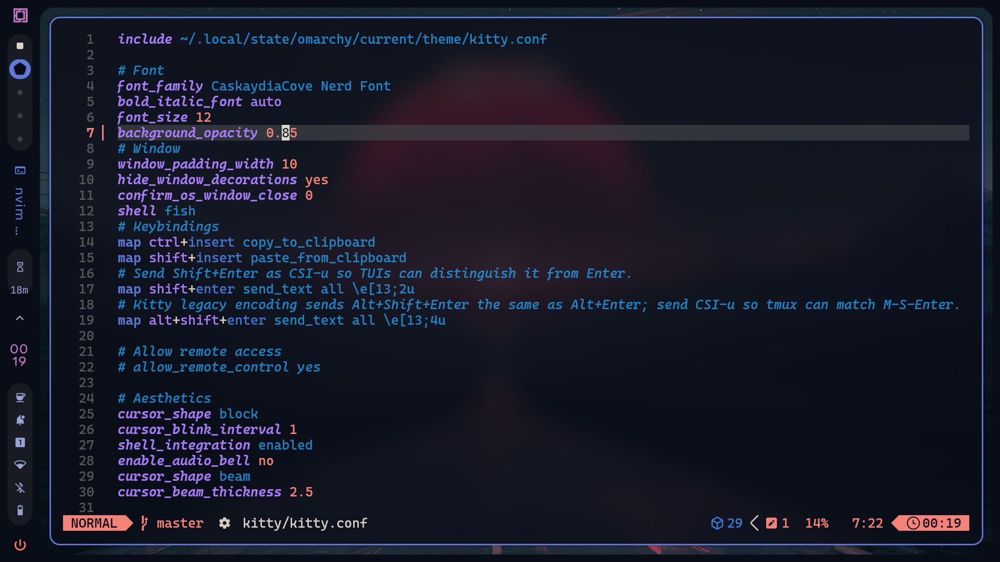

# Omarchy Dots

A modest reliquary of configuration arcana for an Omarchy/Arch-Wayland sanctum: `hypr`, `kitty`, `fish`, `tmux`, `helix`, `yazi`, and `oh-my-posh`, with the usual accumulation of keybinds, aliases, shell incantations, prompt ornamentation, and other minute adjustments made in pursuit of a terminal that feels appropriately *mine*.

<p align="center">
  
  
</p>

## Setup

```bash
git clone https://github.com/ryx9/omarchy-dots.git
cd omarchy-dots
```

```bash
ln -s "$PWD/hypr"   ~/.config/hypr
ln -s "$PWD/helix"  ~/.config/helix
ln -s "$PWD/kitty"  ~/.config/kitty
ln -s "$PWD/fish"   ~/.config/fish
ln -s "$PWD/tmux"   ~/.config/tmux
ln -s "$PWD/yazi"   ~/.config/yazi
```

`omp/` contains the prompt's particular runes.

> Personal configs, not a distribution. Bring your own backups and sufficient willingness to debug your own sorcery.
